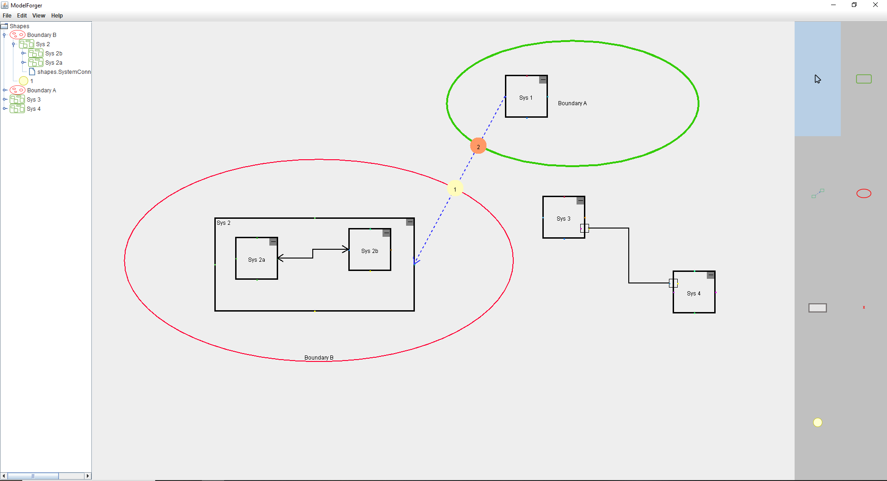

# ModelForger

ModelForger is a sophisticated diagramming tool specifically designed for cybersecurity engineering, focusing on visualizing authorization boundaries and data flows between systems. It enables security engineers, architects, and analysts to create detailed system diagrams that model security boundaries, communication paths, and data exchange patterns.

## Key Features

- **Authorization Boundary Modeling**: Create nested authorization boundaries to represent security domains and their hierarchical relationships
- **System Representation**: Design system components with customizable properties and relationships
- **Data Flow Visualization**: Model directional data flows between systems to analyze information exchange
- **Interface Mapping**: Define and visualize system interfaces for more detailed connection modeling
- **Entry Point Analysis**: Mark and document entry points where data crosses authorization boundaries
- **Operational Data Tracking**: Associate specific data types with connections to document what information is being transferred
- **Mission Hierarchy Visualization**: Map systems and data flows to mission objectives for operational context

## Application Overview



ModelForger allows cybersecurity engineers to:

1. Define distinct authorization boundaries with configurable properties
2. Place systems within appropriate security boundaries
3. Connect systems to show communication paths and data flows
4. Document the specific operational data flowing between systems
5. Identify and analyze entry points where data crosses authorization boundaries
6. Organize and visualize the relationship between systems, data, and mission objectives

## Cyber Data Schema Compatibility

ModelForger reads and writes diagram data in accordance with the Cyber Data Schema, providing seamless integration with other cybersecurity tools and frameworks. The application:

- Exports all diagram elements using schema-compliant attributes
- Maintains proper object relationships in the exported data
- Preserves UUID-based references between systems, boundaries, and data flows
- Supports bi-directional data flows with proper attribute mapping
- Structures operational data to align with schema requirements
- Ensures mission hierarchy data conforms to standardized formats

This schema compatibility enables integration with broader cybersecurity documentation ecosystems and facilitates sharing diagrams across teams and tools.

## Running the Application

To run the ModelForger application, you will need Java 21 JDK installed on your system. Follow the steps below:

1. Download and install Java 21 JDK from the official website.
2. Open a terminal or command prompt.
3. Navigate to the directory where the ModelForger JAR file is located.
4. Run the following command to execute the application:

```
java -noverify -jar ModelForger-2.0.jar
```

## Use Cases

ModelForger is particularly useful for:

- Architecture Analysis Review (AAR) documentation
- Risk Assessment visualization
- Security architecture design and review
- Data flow documentation for compliance purposes
- Communication between security teams and system developers
- Identifying potential vulnerabilities at system boundaries
